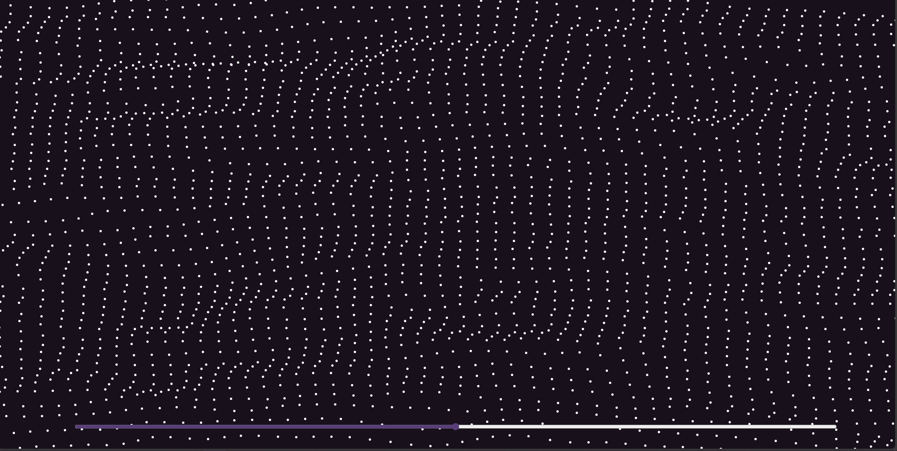

# Wave frontend animation



## What is it?

Funny animation for the sake of a joke and testing the capabilities of React. Uses Perlin noise to display the height.

## How to use it?

1. Clone this repository to your pc using:  
```git clone https://github.com/azya0/frontend-wave.git```
2. Go to the directory:  
```cd ./frontend```
2. Install all dependenses, using npm:  
```npm install```
3. Run, using npm:  
```npm start```
